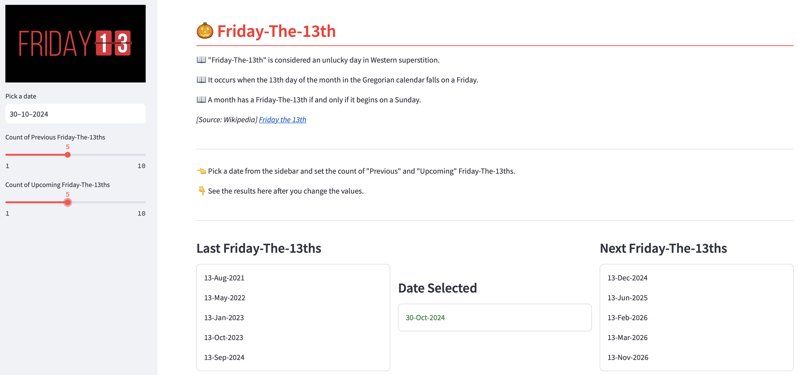

  

# Friday-The-13th
A simple code to see previous and upcoming Friday-The-13ths from a specific date.

## 💻 Requirements

### Python version
* <strong>3.10</strong> and above

## ⚙️ Installation

| | Commands |
| - | - |
| Python | `pip3 install bs4 datetime streamlit` |
|| or `pip3 install -r requirements.txt` |
|| then `streamlit run Friday-The-13th.py` |
| Docker | `docker run -p 8501:8501 -d ashuforshort/fridaythe13th` |

Access through browser: http://localhost:8501

# Preview

